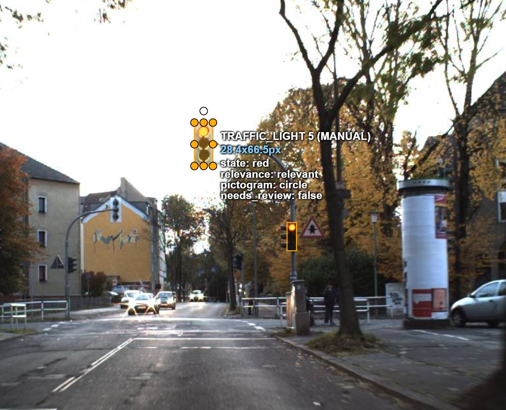
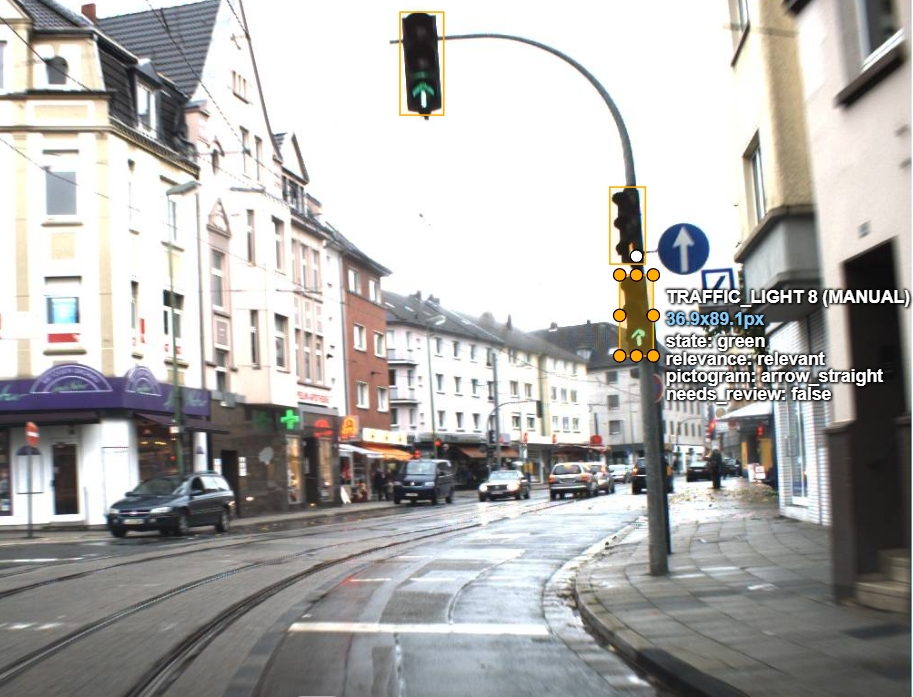
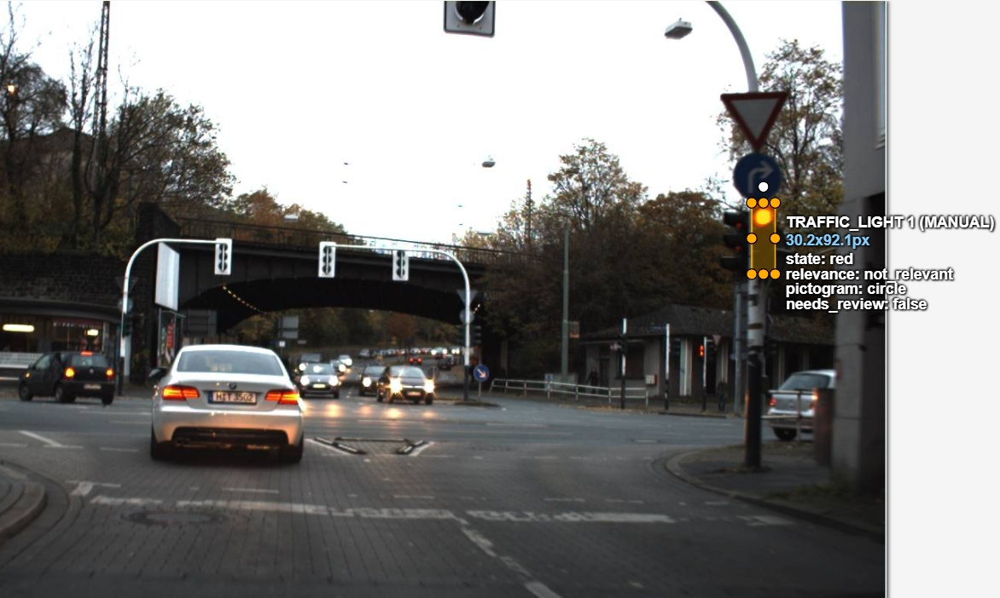

# Annotation guideline — Traffic Light State & Ego-Relevance Detection

**Version:** v3

## 1. Objective + scope

- **Mục tiêu:** Xây dựng dữ liệu huấn luyện cho hệ thống xe tự hành (AV Motion Planner) nhằm nhận biết chính xác trạng thái hoạt động của đèn giao thông và xác định đèn nào có hiệu lực chi phối làn đường của xe chủ.
- **Trong scope (Bắt buộc label):** Mọi hộp đèn tín hiệu giao thông (loại 3 bóng tiêu chuẩn hoặc cụm đèn mũi tên) hướng về phía chiều di chuyển của xe mình, có chiều cao ≥ 8 pixels.
- **Ngoài scope (IGNORE - Không vẽ):**
  - Đèn tín hiệu dành riêng cho người đi bộ (đèn 2 ô hình người trên cột vỉa hè).
  - Đèn quay lưng hoàn toàn hoặc quay vuông góc sang chiều đường cắt ngang.
  - Đèn ở quá xa (chiều cao hộp đèn < 8 pixels) hoặc bị che lấp > 80% diện tích.
  - Đèn vàng cảnh báo nhấp nháy đơn lẻ trên biển báo công trường (thuộc nhóm road signs, không phải cụm đèn ngã tư).

## 2. Annotation unit

- **Dạng hình:** Bounding Box (Rectangle 2D).
- **Đơn vị:** Mỗi cụm hộp đèn vật lý riêng biệt (housing) là **một Bounding Box độc lập**. Nếu trên một cột có gắn 2 hộp đèn cạnh nhau (ví dụ 1 hộp đèn đi thẳng, 1 hộp đèn rẽ trái), phải vẽ **2 Bounding Box tách rời**, không bao chung.

## 3. Geometry rule

- **Bao trọn hộp đèn (Full Housing):** Bounding box phải ôm khít toàn bộ cụm vỏ hộp đèn (bao gồm cả 3 ô đèn và phần chóa/visor che nắng nếu nhìn thấy).
- **Tuyệt đối KHÔNG lấy cột hoặc giá đỡ:** Box không được bao phần cột đỡ, thanh treo ngang hay dây cáp.
- **Quy tắc khi điều kiện ánh sáng yếu / Ban đêm:**
  - *Nếu trời tối nhưng vẫn nhận diện được viền bao của vỏ hộp đèn:* Bắt buộc kéo box bao đủ kích thước toàn bộ hộp đèn (cả 3 ô đèn).
  - *Nếu trời tối hoàn toàn, chỉ thấy quầng sáng của bóng đèn phát ra mà không còn bất kỳ dấu vết nào của vỏ hộp:* Vẽ box ôm sát theo quầng sáng thực tế nhìn thấy, **tuyệt đối KHÔNG tự ước lượng/đoán thêm không gian vỏ hộp**.

## 4. Taxonomy & Attribute Rules

- **Label:** `traffic_light` (Rectangle)

### 4.1. Thuộc tính `state` (Trạng thái đèn)
- `red`: Bóng đỏ đang phát sáng.
- `yellow`: Bóng vàng đang phát sáng (kể cả vàng nhấp nháy).
- `green`: Bóng xanh đang phát sáng.
- `off`: Nhìn thấy rõ cụm đèn nhưng **tất cả các bóng đều tối đen**, không có bóng nào phát sáng (đèn tắt do mất điện, hỏng hóc hoặc hết giờ hoạt động).
- `unknown`: 
  - Đèn bị lóa nắng trực diện (sun glare) hoặc phản quang mạnh làm sáng giả cả 2–3 bóng, không thể xác định bóng nào thực sự cấp điện.
  - Có hiện tượng chập điện làm 2 hoặc cả 3 bóng cùng sáng đồng thời.
  - Đèn bị bóng cây hoặc khói bụi che đúng vị trí bóng sáng khiến không thể phân biệt được màu sắc.

### 4.2. Thuộc tính `pictogram` (Ký hiệu bóng đèn)
- `circle`: Đèn tròn thông thường (toàn bộ diện tích bóng phát sáng tròn).
- `arrow_left`: Ký hiệu mũi tên rẽ trái.
- `arrow_straight`: Ký hiệu mũi tên đi thẳng.
- `arrow_right`: Ký hiệu mũi tên rẽ phải.
- `other`: Ký hiệu đặc biệt khác (chữ thập, vạch ngang xe buýt/xe đạp) nhưng vẫn nhận diện rõ hình dạng.
- `unknown`: Không thể nhận diện được hình dạng bên trong bóng đèn do quá mờ hoặc khoảng cách xa.

### 4.3. Thuộc tính `relevance` (Tính liên quan tới xe chủ)
Đặt vị trí góc nhìn (POV) của người lái xe chủ trong ảnh và quan sát các vạch kẻ đường, vị trí đầu đèn:
- `relevant`: Đèn treo trực tiếp trên làn xe mình đang đi, HOẶC đèn điều khiển luồng đi mà xe mình được phép đi thẳng / rẽ vào tại nút giao này.
- `not_relevant`:
  - Đèn rẽ chuyên dụng (ví dụ mũi tên rẽ trái) khi xe mình đang ở làn bắt buộc đi thẳng.
  - Đèn treo lệch hẳn sang làn ngược chiều hoặc quay sang đường nhánh cắt ngang.
- `unknown`: Không đủ bằng chứng để xác định (mất vạch kẻ đường, nút giao quá hỗn loạn hoặc xe đang đứng giữa giao lộ chưa định hình làn).

## 5. Inclusion / Exclusion Checklist

| Tình huống | Hành động | Giải thích |
|---|---|---|
| Đèn 3 bóng xanh - vàng - đỏ tiêu chuẩn | `LABEL` | Đúng scope xe cơ giới |
| Đèn phụ có mũi tên rẽ trái | `LABEL` | Gán `pictogram = arrow_left`, `relevance` theo làn |
| Đèn người đi bộ (2 bóng hình người trên vỉa hè) | `IGNORE` | Ngoài scope, không phục vụ điều khiển quỹ đạo xe |
| Đèn quay lưng/quay ngang | `IGNORE` | Không điều khiển chiều đi hiện tại của xe |
| Đèn bị cành cây che mất nửa vỏ nhưng bóng xanh sáng rõ | `LABEL` | Vẽ box ôm phần nhìn thấy, `state = green` |
| Đèn cách xe > 150m, chỉ là 1 chấm sáng nhỏ (< 8px) | `IGNORE` | Không đủ độ phân giải để mô hình học hình học |

## 6. Visibility / Occlusion

- **Bị che một phần (Partial Occlusion):** Vẽ bounding box bao quanh **phần hộp đèn thực tế nhìn thấy** (visible area), không vẽ xuyên qua vật cản. Nếu bị che quá 80% diện tích ➔ `IGNORE`.
- **Cắt mép ảnh (Truncation):** Nếu hộp đèn bị viền ảnh cắt ngang, kéo box sát mép ảnh và bao trọn phần nằm trong khung hình.
- **Chói lóa / Phản chiếu (Sun Glare):** Nếu ánh sáng mặt trời chiếu thẳng vào kính đèn gây lóa, không cố đoán màu ➔ Đánh `state = unknown` và bật `needs_review = true`.

## 7. Ambiguity / Escalation

Khi gặp các trường hợp không thể phân xử bằng mắt thường:
1. Gán giá trị `unknown` cho thuộc tính tương ứng (`state`, `pictogram`, hoặc `relevance`).
2. Đánh dấu tích vào ô **`needs_review`** (chuyển sang `true`).
3. Mọi quyết định escalation này đều hiển thị rõ ràng trong thuộc tính XML của object khi export từ CVAT.

## 8. Temporal rule (Dành cho video / Track)

- Nếu gán nhãn chuỗi frame liên tiếp (như clip LISA): Cùng một hộp đèn vật lý phải được duy trì bằng **cùng một Track ID** xuyên suốt các frame.
- Thuộc tính `relevance` và `pictogram` là cố định cho toàn bộ track (không thay đổi giữa các frame).
- Thuộc tính `state` được phép thay đổi theo thời gian tại đúng frame đèn chuyển màu.
- Khi đèn đi ra khỏi khung hình hoặc bị che khuất hoàn toàn: Bắt buộc bấm phím **O** (`Outside`) để kết thúc track tại frame đó.

## 9. Examples

| sample_id | Thấy gì trong ảnh | Expected output | Rule áp dụng |
|---|---|---|---|
| `red_circle` | Đèn đỏ tròn tiêu chuẩn trên giá treo | Bbox ôm sát vỏ đèn, `state=red`, `pictogram=circle`, `relevance=relevant` | Mục 2 & 3 & 4.1 |
| `green_arrow` | Đèn xanh mũi tên rẽ | Bbox ôm sát vỏ đèn, `state=green`, `pictogram=arrow_left/right`, `relevance` theo làn | Mục 4.2 & 4.3 |
| `not_relevant` | Cụm đèn ngã tư điều khiển các luồng rẽ khác nhau | Phân định rõ đèn làn mình (`relevant`) và đèn làn phụ/rẽ (`not_relevant`) | Mục 4.3 (POV relevance) |

### Minh họa trực quan từ CVAT

#### 1. Đèn đỏ tròn tiêu chuẩn (`state=red`, `pictogram=circle`, `relevance=relevant`):

#### 2. Đèn xanh mũi tên định hướng (`state=green`, `pictogram=arrow`):

#### 3. Phân định POV Relevance tại ngã tư (`relevant` vs `not_relevant`):

## 10. Common mistakes

1. **Bao cả cột đèn hoặc giá treo vào Bbox:** Lỗi hình học phổ biến nhất làm sai lệch ground truth kích thước đèn.
2. **Gán nhầm `relevant` cho tất cả các đèn nhìn thấy:** Đèn rẽ trái của làn phụ phải là `not_relevant` đối với xe đi thẳng.
3. **Quên gán `outside` ở frame cuối của track (khi làm video):** Tạo ra các box ma kéo dài đến hết clip.
4. **Nhầm lẫn giữa `off` và `unknown`:** Đèn không sáng bóng nào là `off`; chỉ khi lóa nắng không nhìn rõ hoặc sáng bất thường nhiều bóng mới là `unknown`.
